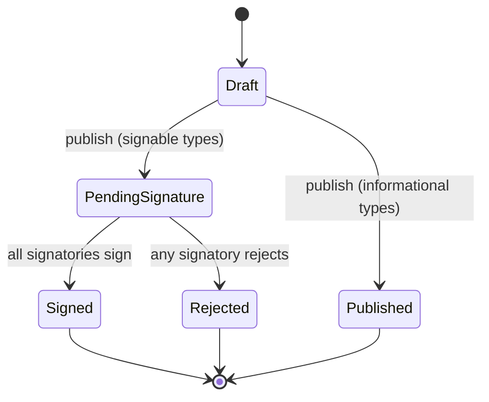

# Document Signature Flow

Functional guide to how employment documents are drafted, published, signed, and
completed in AMS. This describes **what happens and why**, from each actor's
point of view. For the technical invariants (where the logic lives, how the
body is frozen, tenancy) see the `## Documents` section of
[`architecture.md`](architecture.md).

---

## What this is for

The documents module lets an organization put HR paperwork — contracts, annexes,
pacts, notifications, certificates — in front of employees and collect a
**firma electrónica simple (FES)**: a legally valid simple electronic signature
under **Ley 19.799**. Because employment documents are *instrumentos privados*,
a simple signature is sufficient (Art. 3 & 4) — the platform is **not** a
certification provider and does not issue certificates. The flow's job is to
capture enough **evidence** that a signature can be defended later: who signed,
when, from where, that they consented, and that the content was not altered.

Only three document types are **signable**: **contracts, annexes, pacts**. Every
other type (certificates, regulations, notifications, requests, others) is
informational — it is published for the record but never asks for a signature.

---

## The actors

| Actor | Role in the flow |
|---|---|
| **Admin** | Drafts the document, publishes it, monitors signature status, can re-send an invite. |
| **Employee** | The person the document is *about*. Always a signatory on signable documents; signs from their **"Mis documentos"** panel. |
| **Legal representative** | A user flagged `is_legal_rep` in the organization. Zero, one, or two of them co-sign, depending on the document's `legal_rep_signatories` setting. |

Legal reps sign through the **same** "Mis documentos" panel the employee uses —
the panel shows every document that lists you as a signatory, not only your own.

---

## The lifecycle at a glance

A document's `status` moves in one direction. Once it reaches **Signed** or
**Rejected** it is terminal.

---

## Step by step

### 1. Draft
The admin writes the document (Tiptap editor) using `{{variable}}` placeholders,
picks the employee, and — for signable types — sets how many legal reps must
co-sign and whether signing is **ordered** (see below). Nothing is sent yet.

### 2. Publish
The admin clicks **Publicar**. On publish:
- The body is **frozen**: every `{{variable}}` is resolved to the employee's real
  data, and `published_at` is stamped. The document can no longer be edited —
  this frozen text is exactly what everyone signs.
- For signable types, one **pending signature** is created per signatory: the
  employee, plus the first *N* legal reps. Each signatory receives a
  *"Un documento espera tu firma"* email.
- The document moves to **Pending signature**.

Informational types simply become **Published** with no signatures.

### 3. Request a code
The signatory opens the document in **Mis documentos** and clicks **Solicitar
código**. The system generates a **6-digit one-time code**, valid for **15
minutes**, and emails it to the signatory's **personal email address**. This
code is what authors the signature — possession of the personal inbox plus the
authenticated session together identify the signer.

Clicking **Reenviar código** issues a fresh code and invalidates the old one.

### 4. Sign
The signatory enters the code and clicks **Firmar documento**. If the code
matches and is still valid, the signature is recorded together with its
**evidence** (see next section). If the code is wrong or expired, signing is
refused with an inline error and nothing changes.

### 5. Completion
- **When the last signatory signs**, the document becomes **Signed**: `signed_at`
  is stamped, an authoritative **signed PDF** is generated (the frozen body plus
  a *"Firmas electrónicas simples"* block listing each signer's name, RUT, email,
  timestamp, and verification hash) and stored, and the employee receives a
  *"Documento firmado por todas las partes"* email. They can then download the
  signed copy from their panel at any time.
- **If any signatory rejects** (with an optional reason), the document becomes
  **Rejected** immediately. The rejecter's signature is marked *rejected*, and
  **every other still-pending signature is cancelled** — a rejected document can
  no longer be signed by anyone.

---

## Ordered vs. unordered signing

- **Unordered** (default): all signatories are invited at once and may sign in
  any order.
- **Ordered** (`ordered_signing`, only meaningful with two legal reps): signing
  is sequential, numbered **employee first**. A later signatory cannot request a
  code or sign until everyone ahead of them has signed — their panel shows
  *"Podrás firmar cuando sea tu turno."*

---

## What evidence is captured (and why)

Every signature stores the following, which is what makes the FES defensible
under Ley 19.799 (Art. 2 f/i and 5) and satisfies the integrity requirement of
Resolución 38 (Art. 8 / 14b):

| Evidence | Purpose |
|---|---|
| **Signer identity** (authenticated user: name, RUT, email) | Identifies the author of the signature (Art. 2 f). |
| **Timestamp** (`signed_at`) | The *fecha electrónica* — the moment the act occurred (Art. 2 i). |
| **One-time code** | Consent: a deliberate, voluntary signing act. |
| **IP address + user agent** | Attribution of the act to a device/session. |
| **Content hash** (SHA-256 of the frozen body) | Integrity — proves what content was signed and detects any later tampering. Every signatory commits to the same hash. |
| **Rejection reason** (on reject) | Record of why a document was declined. |

> **Known limitation.** A simple signature does **not** by itself make faith as to
> its *date* in court unless an accredited timestamp is used (Ley 19.799 Art. 5
> N°2). AMS records a reliable server timestamp; an accredited timestamp is out
> of scope for FES and would be a separate enhancement.

---

## Signature states

| State | Meaning |
|---|---|
| **Pending** | Awaiting this signatory's action. |
| **Signed** | Signed, with evidence recorded. |
| **Rejected** | This signatory declined — kills the whole document. |
| **Cancelled** | Was pending when another signatory rejected; can no longer be signed. |

---

## Notifications summary

| Email | Sent to | When |
|---|---|---|
| *Un documento espera tu firma* | Each signatory | On publish |
| *Tu código de firma electrónica* | The signatory (personal email) | On **Solicitar/Reenviar código** |
| *Documento firmado por todas las partes* | The employee | When the document is fully signed |

The admin can also **re-send** the original signing invitation from the document
detail page for any still-pending signatory.

---

## Correcting a mistake

Because a published document's body is frozen and signed against, **it can only be
edited or deleted while it is a Draft** — the admin's Edit/Delete controls
disappear once it is published, and the routes reject the attempt (403). So:

- **Spotted the error before publishing?** Edit the draft freely.
- **Already sent for signature (or signed)?** You do **not** edit in place — that
  would silently change what people were asked to sign. The correct move is to
  **void the erroneous document and issue a corrected new one** (for a signed
  document, a rectifying replacement that supersedes it). The erroneous document
  stays in the record as an immutable audit trail.

> The **void / cancel** action and a **"duplicate as draft"** shortcut that make
> re-issuing a one-click flow are a planned follow-up. Until then, an admin
> re-creates the corrected document manually; the erroneous one is left in place
> (it cannot be signed once voided) rather than deleted.

---

## Access & permissions

The panel and signing actions are gated by Spatie permissions, not roles:
`ViewOwn:Document` (see the panel and open a document) and `SignOwn:Document`
(request a code, sign, reject). Both are granted to the `employee` role by the
seeder. A signatory can only reach a document that belongs to them or lists them
as a signatory; everything else returns 403.
